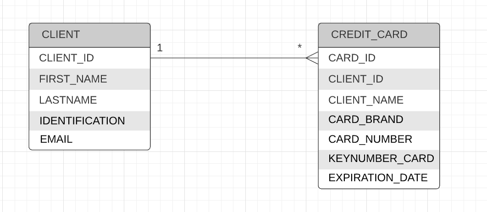

# NUVU Challenge
Repository for make a full stack solution on the test in NUVU as a Full Stack Developer.

The challenge solution was designed in three layers corresponding from each component's application.

* Database Layer: Using technologies such as Mysql 8.
* Backend layer: Using technologies such as Java 8, Spring boot, JPA, RESTFUL services, and Junit.
* Frontend layer: Using technologies such as Angular 11 (+2), unit testing, and typescript.

The solution of the challenge could be downloaded through Git, clone this repository https://github.com/JulianLozanoG/nuvuChallenge.git and get into the nuvuChallenge, 
/// Docker

# Prerequisites
Java 1.8, Docker compose

# Planning
I made some steps associated to the final solution such as:
* Design.
* Development.
* Testing.
* Deploy.

These phases were pointing in time with the planning tool Trello, I made a schedule activities for each layer:
* Backend: https://trello.com/b/KtFbCKLQ
* Frontend: https://trello.com/b/X6y55ngU

# Design phase

